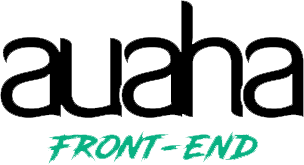
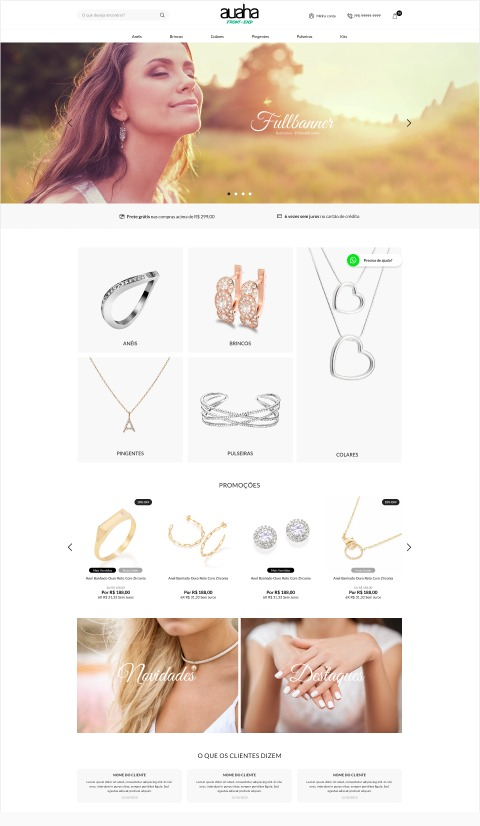
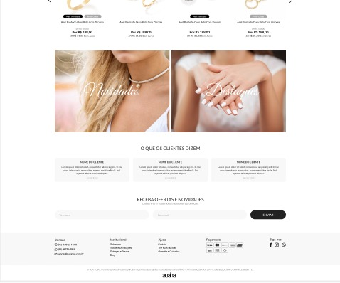

<p align="center">
  
</p>

<p align="center">
  
  
  
</p>
<br>

## 🧪 Tecnologias

Esse projeto foi desenvolvido com as seguintes tecnologias:

- [React](https://reactjs.org)
- [TypeScript](https://www.typescriptlang.org/)
- [Firebase](https://firebase.google.com/)

## Deploy do projeto
  ##### Link de acesso: https://challenge-auaha-ozn9hlqy1-luisevandro.vercel.app/
## Como executar

Clone o projeto e acesse a pasta do mesmo.

```bash
$ git clone https://github.com/LuisEvandro/challenge-auaha.git
$ cd challenge-auaha
```

#### Para iniciá-lo, siga os passos abaixo:

O Projeto usa conexão com firebase então requer conexão com o mesmo.
Crie um arquivo na raiz do projeto ".env.local" com as chaves do seu firebase.
*Atenção no firebase requer liberar as regras de leitura e gravação do banco de dados*

#### Dados do ".env.local"
```bash
  NEXT_PUBLIC_FIREBASE_API_KEY_ID=SEU KEY ID
  NEXT_PUBLIC_FIREBASE_AUTH_DOMAIN=SUA AUTH DOMAIN
  NEXT_PUBLIC_FIREBASE_PROJECT_ID=SEU PROJECT ID
  NEXT_PUBLIC_FIREBASE_STORAGE_BUCKET=SEU STORAGE BUCKET
  NEXT_PUBLIC_FIREBASE_MESSAGING_SENDER_ID=SEU MESSAGING SENDER ID
  NEXT_PUBLIC_FIREBASE_APP_ID=SEU APP ID
```

No firebase requer a criação de um "Firebase Database", por padrão crie algumas coleções

#### Coleções
- users
- orders
- products
- banners

products e banners requer adicionar os registro manualmente de acordo com os formatos a seguir

#### Products
  ** Atenção as imagens declaradas nos campos de "imagePath" devem estar na respectiva pasta do projeto **
```bash
  {
    "imagePath": "/images/products/NOME DA IMAGEM",
    "name": "Nome do produto",
    "price": 188.00,
    "quantity": 1,
    "isBestSeller": true,
    "isFreghtFree": true,
    "promotinalPrice": 5,
    "percentageOff": "10%"
  }
```

#### Banners
  ** Atenção as imagens declaradas nos campos de "imagePath" devem estar na respectiva pasta do projeto **
```bash
  {
    "imagePath": "/images/banner_main.png",
    "name": "Anel Banhado Ouro Reto Com Zirconia",
    "order": 1
  }
```

#### Como rodar o projeto
```bash
# Instalar as dependências
$ yarn

# Iniciar o projeto
$ yarn dev
```
O app estará disponível no seu browser pelo endereço http://localhost:3000.

## 🔖 Layout
<p align="center">
    
    
</p>
Feito com 💜 by Luis Evandro